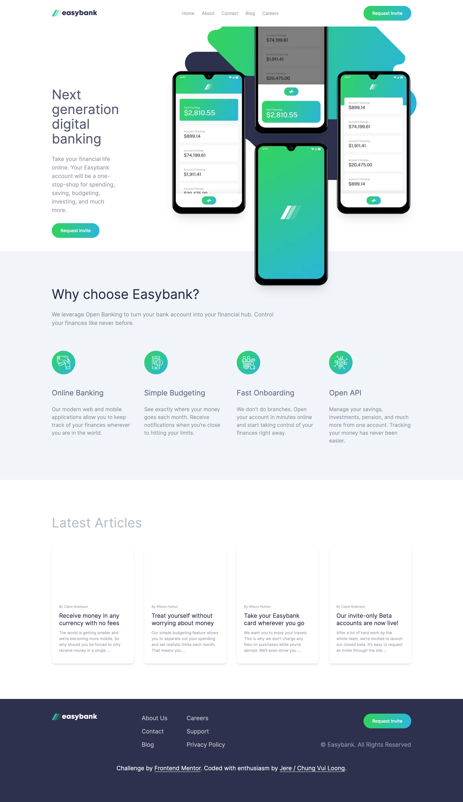

# Frontend Mentor - Easybank landing page solution

This is MrJay's solution to the [Easybank landing page challenge on Frontend Mentor](https://www.frontendmentor.io/challenges/easybank-landing-page-WaUhkoDN).

## Table of contents

- [Overview](#overview)
  - [The challenge](#the-challenge)
  - [Screenshot](#screenshot)
- [My process](#my-process)
  - [Built with](#built-with)
  - [Continued development](#continued-development)
- [Author](#author)

## Overview

### The challenge

Users should be able to:

- View the optimal layout for the site depending on their device's screen size

### Screenshot



### Links

- Solution URL: [Github](https://github.com/chungvuiloong/easybank-landing-page)
- Live Site URL: [Vercel](https://mrjays-easybank-landing-page.vercel.app/)

## My process
Starting with mobile first approach, I analyse both the designs in mobile and desktop view. By doing so, I can understand the structure better and design a layout that suits adjusts according in both mobile and desktop.

- There are five sections (Desktop).
    - Navbar
      - Logo
      - Nav links
      - Request Invite Button
    - HeroBanner
      - Left section
        - Title
        - Paragrah
        - Button
      - Right section (image)
    - Choose (Why Choose easy bank section)
      - Title
      - Paragraph
      - Cards
        - Logo
        - Card Title
        - Card paragraph
    - Latest Articles 
      - Title
      - Card
        - Author
        - Card Title
        - Card paragraph
    - Footer
      - Left column 
        - Logo
        - Social Media
      - Middle column
        - Left
        - Right
      - Right Column
        - Button
        - Copyright

Components
- Request Invite Button

### Built with

- Semantic HTML5 markup
- Flexbox
- Mobile-first workflow
- [Next.js](https://nextjs.org/) - React framework
- DaisyUI

### What I learned

In this challenge, I find the heroBanner image and its structure a new learning opportunity. I requires the use of max width to extend the image out of the image wrapper.

```
<div className="relative md:order-last order-first basis-1/2 mx-auto -mt-24 max-w-5xl 
                    lg:ml-10 lg:mr-0 lg:max-w-none lg:flex-none xl:ml-32">
                        <div className="relative lg:max-w-none sm:max-w-5xl max-w-3xl flex-none ">
                            <Image
                            src={HeroBannerBGImage}
                            alt="App screenshot"
                            width={2432}
                            height={1442}
                            className="absolute w-[76rem]"
                            />
                            <Image src={FrontImage} alt={"Mobile phones"} className='relative'/>
                        </div>
                    </div>

```

### Continued development

In the near future, I am planning to add more features to this challenge such as:
- Hover States
- Adding additional pages
- Login to a banking system.
- After login there is a dashboard.

## Author

- Website - [MrJay's Simple Portfolio](https://mrjays-simple-portfolio.vercel.app/)
- Github - [Jere / Chung Vui Loong](https://github.com/chungvuiloong)